# Adobe-XD-UI-Design

 I have designed a mobile app from scratch and created UI for it by using Adobe XD. 

 

This is the splash screen

 
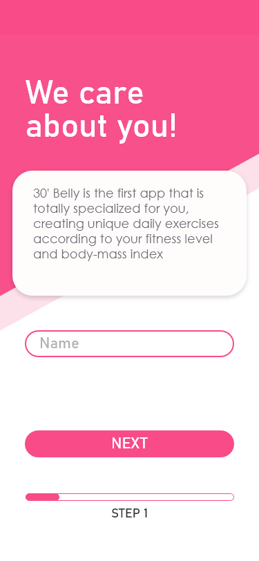

This is the first page of dign up pages. For a better user experience, I split the sign up pages and in each step, I wanted to explain why we need the asked information to help our users to understand what they are signing up to. /p>
 
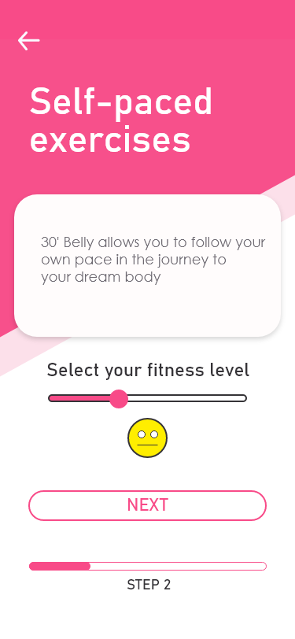
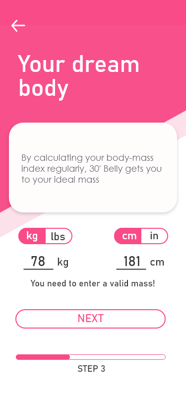
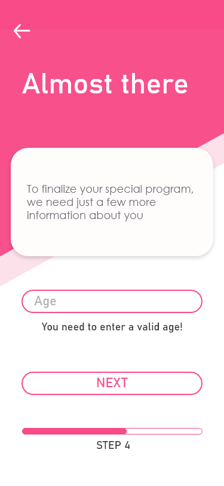
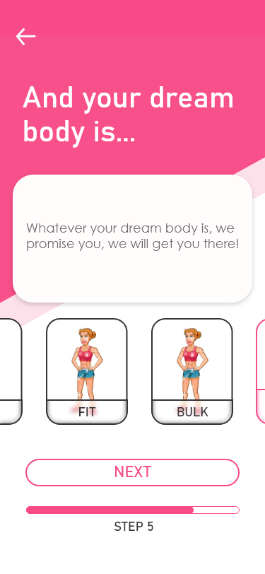
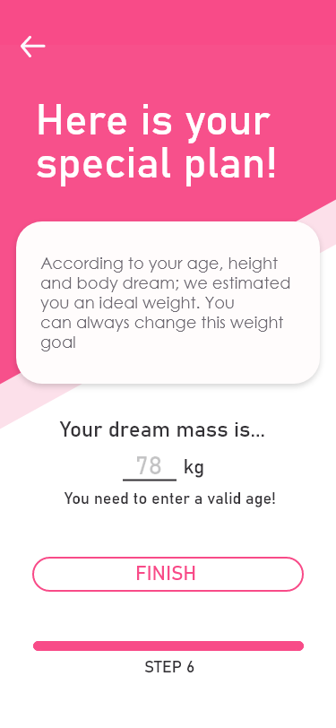
 
 
 

  
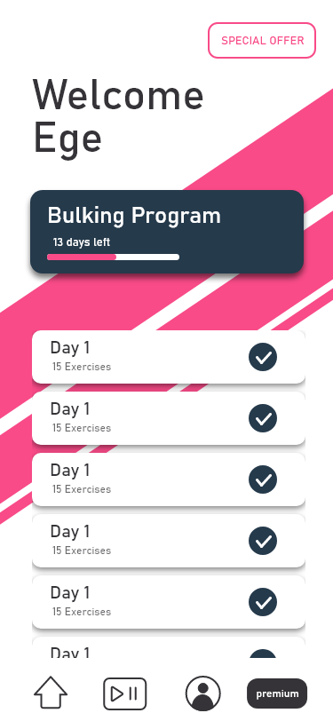

This is the home page. After a succesfull sign up, users are directed to this page.

  
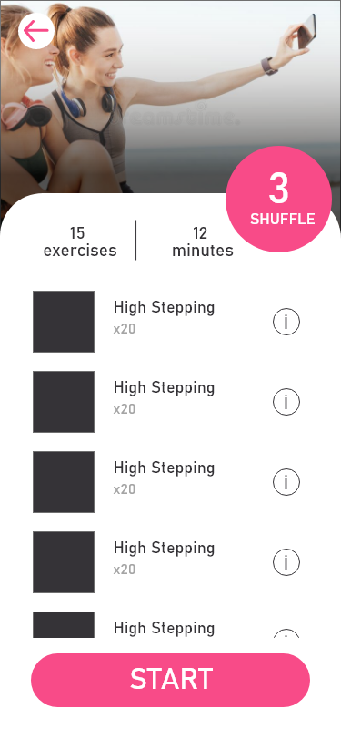

This is the exercise session page. When users press to one of the days in the home page, they are directed to the exercise of that day.

  

When users wants additional information about a specific exercise, they can press on it and the description and an explanatory video of the exercise will pop up.

  
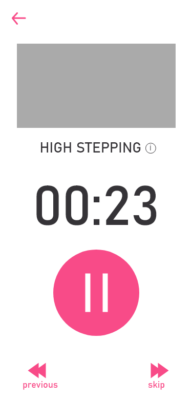

When exercise session starts, users will see this page.

  
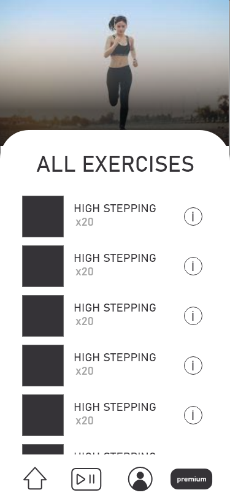

This is a page where users can see all of the available exercises. This page can be accessed from the bottom navigation bar located on the home screen.

  
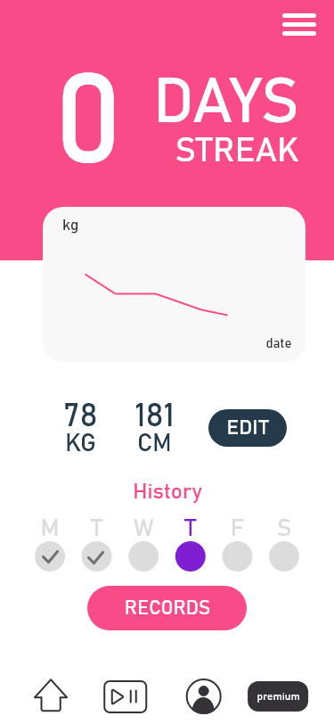

This is the profile page. In this page, users can see their active days. They can edit their wights and see their progress.

 
 
  

This menu is accessed by the My Profile page. Settings and other options will be displayed here.

  
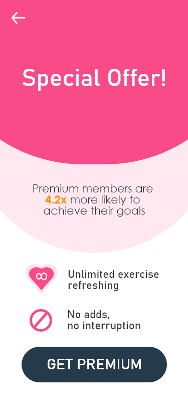

This page redirects users to the payment pages if they decide to buy the premium package.

  

 

This is the home page

